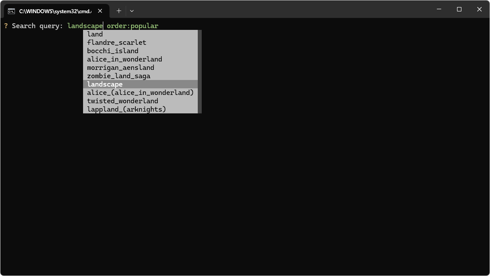
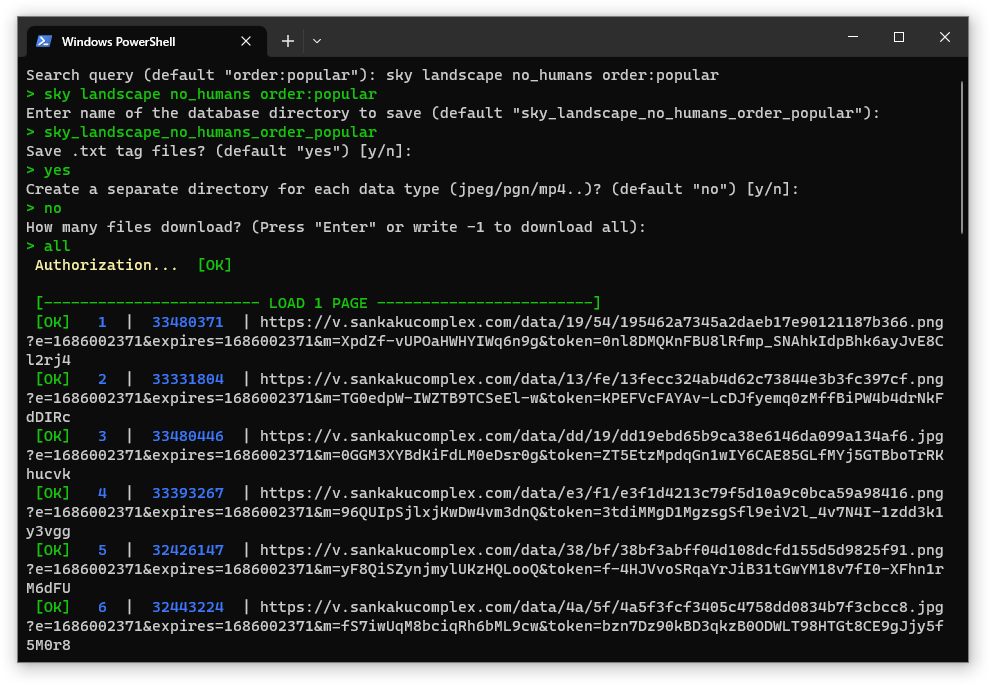
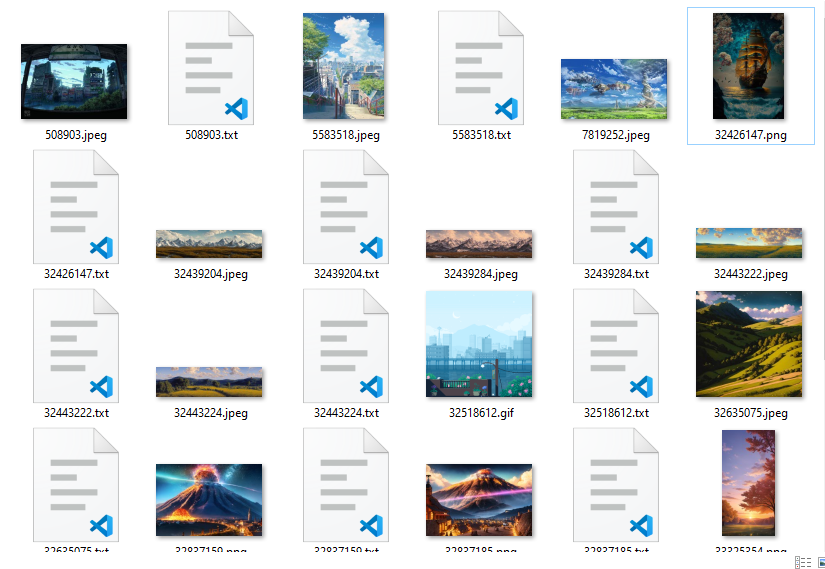

# Info

This script allows you to parse and download content from SankakuComplex. It supports account authentication, enabling you to:
- Download your bookmarks
- Access media unavailable without authentication or a premium account
- Bypass the 50-page limit (requires a subscription)

## Features

- **Full Content Download** – Supports all media types, including videos.
- **Simple Search Queries** – Use the same search syntax as SankakuComplex.
- **Bookmark Downloading** – Retrieve your favorites with `fav:YOUR_USERNAME`.
- **No Login Required** – Skip authentication by leaving login credentials blank in `config.json`.
  - No API keys needed – just a username and password!
- **Tag Saving** – Optionally stores all tags, useful for training neural networks.
- **Content Sorting** – Automatically organizes files into separate folders by format.
- **Customizable Download Limits** – Specify the number of media files to download.

## Preview

# Usage

### Requirements
- Python 3

### Setup & Execution
1. Edit `config.json` to add your `username` and `password` (optional).
2. Run `start.bat` (Windows) or `start.sh` (Linux). The first setup may take some time.
3. Follow the console prompts.
4. Enjoy your downloads!