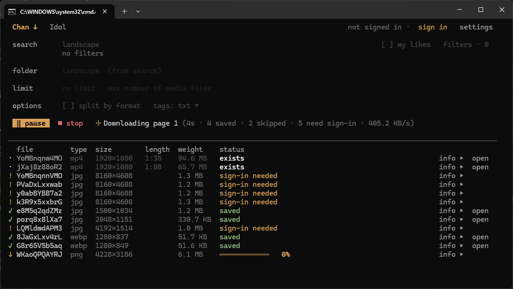
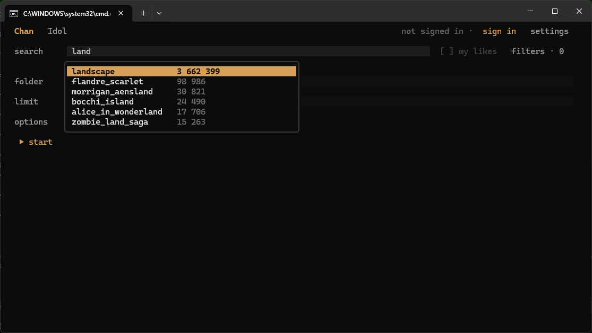
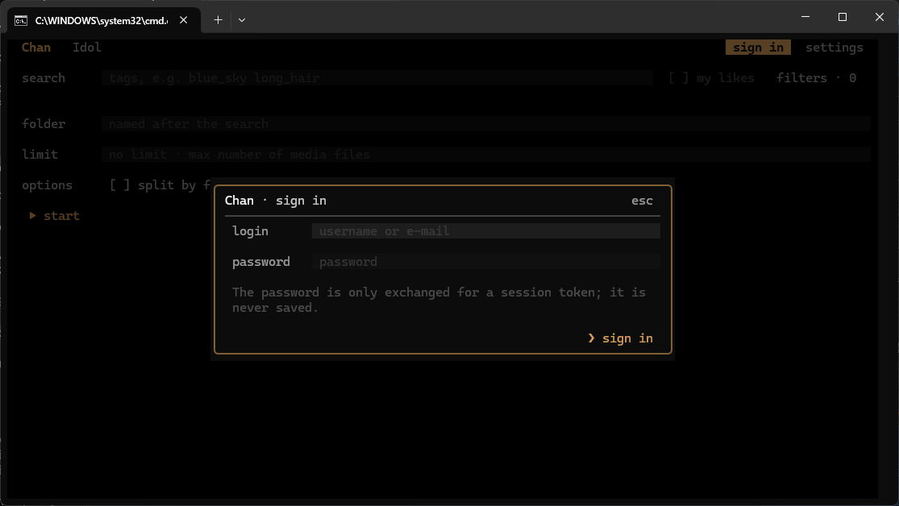
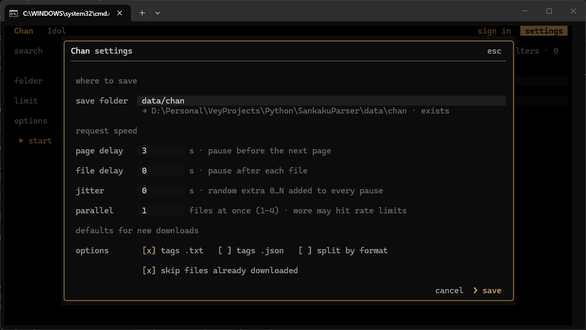

# Info
A terminal app for searching and downloading content from SankakuComplex. It was made for building datasets to train AI models: every image can be saved together with its tags, ready to be used as captions.

It supports both **chan.sankakucomplex.com** and **idol.sankakucomplex.com** and works anonymously. With an account you can also:
- Download your likes
- Access media unavailable without authentication or a premium account
- Go past page 50 of a search, if your account has a paid Sankaku subscription

> **About the 50-page limit:** Sankaku itself stops every search after 50 pages unless the account has a paid subscription. This limit comes from Sankaku's servers, not from this app — the app downloads as far as Sankaku lets your account go.

## Features
- **Chan and Idol** – Each site in its own tab; both can download at the same time
- **Sign-in** – Optional; the password is never saved and you stay signed in between runs
- **Search Filters** – Sort, date, star rating, size, file type, video duration, and posts liked, uploaded or voted by a user. **my likes** limits the search to your own likes
- **Tag Saving** – Tags next to each file, as `.txt` and/or `.json` (grouped by category — handy for training datasets)
- **Resume** – Files you already have are skipped, so an interrupted search can be continued
- **Parallel Downloads** – Up to 4 files at once, with adjustable pauses between requests (in **settings**)

## Preview

# Usage

## Requirements
- Python 3.10+

## Setup & Execution
1. Run `start.bat` — it is a polyglot script: double-click it on Windows, or run `./start.bat` on Linux. The first run creates a virtual environment and installs the dependencies, which may take some time
2. Pick the **Chan** or **Idol** tab. Each tab checks its sign-in on start and shows the result in the top-right corner
3. Click **sign in** to sign in, or browse anonymously
4. Enter a search query (matching tags drop down as you type), optionally set **filters**, and press **▶ start**
5. Enjoy your downloads!

Each search goes to its own folder under the site's save folder (`data/chan/` or `data/idol/` by default), named after the search unless you type another name in **folder**. **limit** caps the number of media files; leave it empty to download everything. **split by format** sorts files into subfolders by extension, and **tags** picks the tag files to write.

A tab that is working in the background shows its state in its title: `↓` downloading, `‖` paused.

## Controls

The controls behave like a player: `▶ start` when idle; once running it turns into `‖ pause` and `■ stop`, and a paused download offers `▶ resume`.

- **Mouse** – click anything; scroll the download list with the wheel
- **Keyboard** – arrows or `Tab` move between controls, `Enter` or `Space` presses a button or flips a checkbox, `Esc` closes a dialog, `Ctrl+Q` quits
- **Suggestions** – while a list is open under a field, `↑`/`↓` pick an entry, `Tab`/`Enter` take it, `Esc` closes the list

Pause takes effect between files, so the file in flight is always finished and never left half-written. Stop is immediate: the transfer in progress is cancelled and its partial file is deleted, so no corrupt media is left behind.

Scrolling up in the download list stops it from following new files; a **↓ scroll to bottom** button then counts the new ones and jumps back down.

## Search limits

Sankaku rations "advanced" filters: **without signing in, a search may use at most 2** of date, file type, duration, size and the user filters (sort, star rating and plain tags are free). The filters dialog counts them as you go. Searching by who *liked* posts usually times out on Sankaku's side without signing in, and a user who keeps likes or votes private cannot be searched by them.

Posts that need an account are listed as `sign-in needed` instead of being downloaded.
