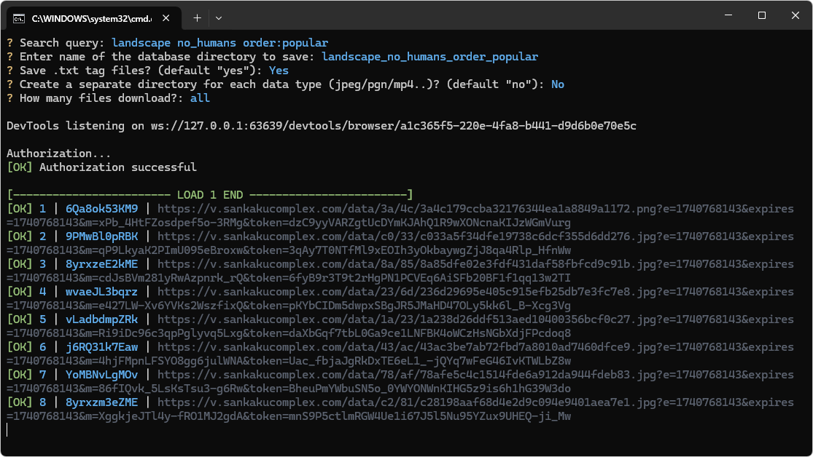
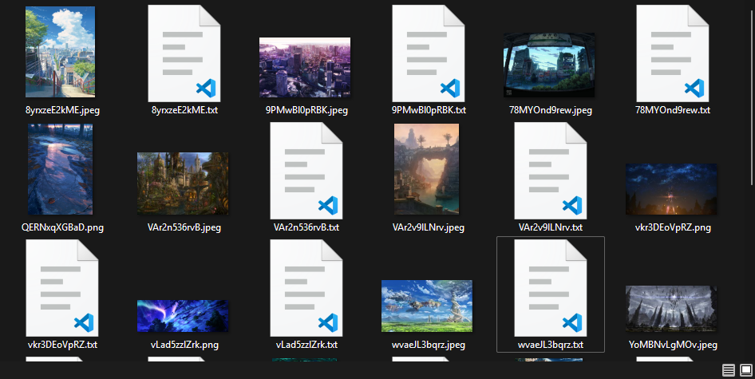

# Info

The script for parsing sankakucomplex, can use your account, it is useful if you want to download your bookmarks, upload media unavailable without authorization or a premium account, or bypass the limit of 50 pages (not available if you do not have a subscription to sankaku)

Features:

1. You can download all content, including videos

2. Write a search query in the same way as you do in sankaku!

3. Upload your bookmarks simply by typing fav:YOUR_USERNAME

4. Don't have an account or don't want to log in? Just do not fill in your login details in the config and immediately run the script

   4.1 No complicated API keys! Just login and password!

5. Optionally saves all tags, this is useful if you are going to train a neural network

6. You can sort the content by format, the script will create a separate folder for each file type

7. You can select the number of media you want to download

# Using

You need Python 3 version

1. Fill in `config.json` with `username` and `password` to use your account when parsing 

   Skip this step if you don't want to log in

2. Just run `start.bat` if you are using Windows or `start.sh ` for Linux, the first installation may take some time

3. Follow the prompts in the console

4. Done!

